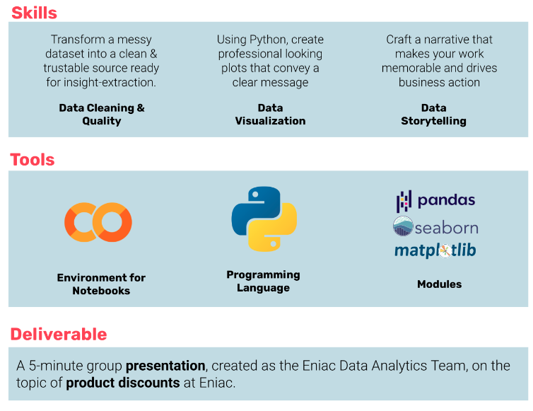

# Data Cleaning & Storytelling Case Study

Eniac is an online marketplace specializing in Apple-compatible accessories. It was founded ten years ago in Spain and has since grown and expanded to other neighboring countries.

In addition to offering a wide catalog of products at competitive prices, Eniac provides friendly and professional tech support and consultation to its customers. The warmhearted spirit that thrives with direct contact with the customers is at the core of the company.

Since the company went public, investors have been pushing for Eniac to scale up the business and become a major e-commerce player globally. It goes without saying that it is an arduous challenge to do so while retaining the human side of the business, which is Eniac’s emblem.

# Table of Contents

[Objective](#Objective)
[Overview](#Overview)
[A problem with the Data](#a-problem-with-the-data)

## Objective
The objective of the analysis is to address the following topics.

* How should products be classified into different categories to simplify reports and analysis?
* What is the distribution of product prices across different categories?
* How many products are being discounted?
* How big are the offered discounts as a percentage of the product prices?
* How do seasonality and special dates (Christmas, Black Friday) affect sales?
* How could data collection be improved?

## Overview

#### A problem with the Data
The data appears to have some inconsistencies - The real value good Data Analysts can bring is usually to male dirty data usable and trustable.

## Dataset & CSVs

##### orderlines.csv

* id – a unique identifier for each row in this file
* id_order – corresponds to orders.order_id
* product_id – an old identifier for each product, nowadays not in use
* product_quantity – how many units of that product were purchased on that order
* sku – stock keeping unit: a unique identifier for each product
* unit_price – the unitary price (in euros) of each product at the moment of placing that order
* date – timestamp for the processing of that product

##### products.csv

* sku – stock keeping unit: a unique identifier for each product
* name – product name
* desc – product description
* price – base price of the product, in euros
* promo_price – promotional price, in euros
* in_stock – whether or not the product was in stock at the moment of the data extraction
* type – a numerical code for product type

##### brands.csv

* short – the 3-character code by which the brand can be identified in the first 3 characters of products.sku
* long – brand name

##### orders.csv
* order_id – a unique identifier for each order
* created_date – a timestamp for when the order was created
* total_paid – the total amount paid by the customer for this order, in euros
* state - Order status ( place order, shopping basket, completed, cancelled, pending)

## Exploring the data is critical - keep asking questions

* How many orders are there?
* How many products are there?
* What period of time do these orders comprise?
* How many orders are Completed?
* How should revenue be computed?
* What is the time period that the dataset covers?
* What is the overall revenue for that time?
* Are there seasonal patterns in the evolution of sales?
* What are the most sold products?
* What are the products that generate the most revenue?
* Any changes in revenue since introduction of discounts?
* What is the average difference between total_paid and unit_price_total?
* What is the distribution of these differences?
* Can all the differences be explained by shipping costs? If not, what are other plausible explanations?
* If there are differences that you can’t explain: what should you do with these orders?

## Data Cleaning & Data Quality

#### Remove duplicate rows
remove rows that contain exactly the same values and that appears twice across all columns

#### Handle missing values
Explore missing values and decide what should be the strategy for dealing with them:

* drop them
* imputation method
  - Categorical data can be filled in with a placeholder such as "Unknown"
  - Numerical data can be filled in with mean, median if necessary
  
#### Change data formats
* Convert categorical variables to numerical format

####  Outliers & Data Inconsistencies
* scatter plots can be useful to spot outliers
* text format can sometimes cause problems e.g "Female", "female" - standardise values when needed

## Data Analysis
Here we find out the main objective of our analysis, whether offering discounts is beneficial for the company. 
Keep in mind, this means looking at which products have been sold therefore looking into the `orderlines` table.
Discounts are defined as the difference between `orderlines.unit_price` and `products.price`. Merging both tables and creating a column that contains the discount is, thus, probably a good idea.

#### Analyse Sales Trends

* analyse sales trends over time
* analyse seasonal patterns

#### Analyse Revenue

* `orderlines` , `orderlines.unit_price` , `products.price` to understanding pricing
* Analyse the products that bring in the most profit/revenue

#### Analyse Customer Behaviour

* discover most sold product and customer purchase behaviour
* identify high value / loyal customers

## Data Visualisation
Plots are not just pretty graphs to show in a presentation!
They can help Data Analysts find something they were not specifically looking for. They also tell beautiful stories. 
Data insights are more valuable when they are easily understood and communicated and visualisation can definitely help accomplish this. 

* It's important to choose the right Visusalisation
  `bar chart`, `line graphs`, `scatter plots`
* It's important to choose the right colours and sizes for the visualisations
  'Matplotlib`, `Seaborn` , `Plotly` - annotate plots and choose the right colours and size
* It's important to be creative by using interactive dashboards tools such as Tableau or PowerBI
    - Python has other libraries that can offer this too

## Conclusion

Following the guidelines above, I have successfully cleaned our data, extracted the data I need in order to get valuable insights from it and have shared and communicated my expert opinions and insights by addressing the main questions I was tasked with. **What should Eniac's strategy be concerning Discounts**
With the help of my thorough analysis and visualisation I was able to do so effectively. 
  

